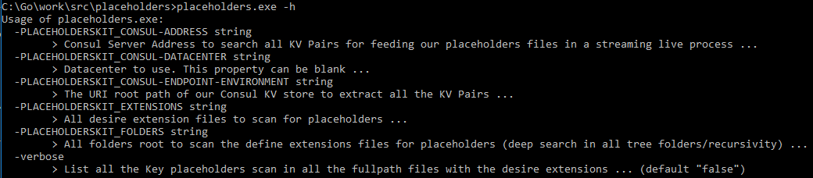
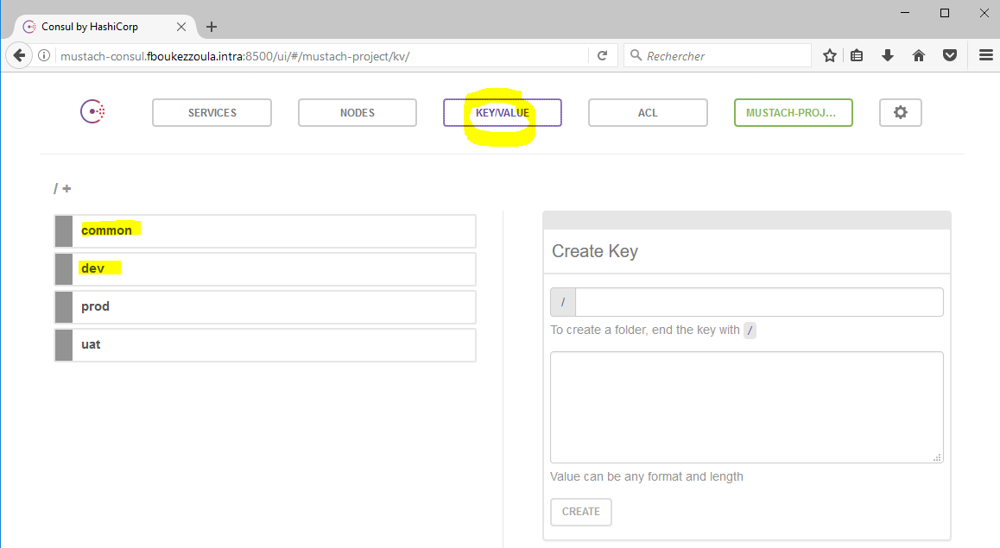

# PlaceholdersKit {{...}}

Placeholder text until I can flesh this out more. I'll throw the source up on here for a later release (when I'm more happy with it, because it's my first Golang program); only created the Repo this early to host an Alpha release. 

Download the [Alpha Release](https://github.com/fboukezzoula/PlaceholdersKit/releases).

Thank you for your patience and for your feedbacks ...

This program is useful for a Docker multi-environment deployment scenarios (such as INT, DEV, UAT, PRE-PROD, PROD environments, etc ...). Of course, it can be use for another type of multi-environment deployment scenarios : Cloud On-Promise, CSP, etc ..

# Goals and why this tool is really useful :

* We have exactly the same docker image (same tag) : with the same binaries, application files and configurations files (with all the placeholders). All these files are already on the target(s) folder(s) of the docker application.

* Placeholders are configurable entries in your application that will be set to an actual value at deployment time. This allows the deployment docker image to be **environment-independent and thus reusable**.

* At deployment time, the placeholders will be resolved from dictionaries (taken from a Consul KV store) that are assigned to the target environment. During the deployment, that can be assimilated as a "run" goal for Docker ecosystem (docker stack deploy, docker-compose up, docker run ... ), the PlaceholdersKit tool will replace all the placeholders, all the key names which are delimeter by {{...}} per default with their own values (KV Pairs). These replacements in all your configuration files (you have only to define the extension files for beeing scan and finding in their content all the placeholders such as config, properties, xml files ...) will be done with the correct value _**depend on the target deployment environment**_. 

* These environment values are taken from a Consul KV store during the deployment ("on the fly/live streaming"). The primary use case for this PlaceholdersKit tool is to be able to build native Consul-based configuration into your Docker image without needing glue such as environement variables then use multiple sed commands to modify the files, can use tempories files or copy/move files, etc ...

# What are the command line arguments for this PlaceholdersKit tool ?

The command line arguments are :

_**-h**_ :<br />
Help of the PlaceholdersKit tool which explain all the command line arguments. <br />

_**-verbose**_ :<br />
More output logs. List all the Key placeholders scan in all the fullpath files with the desire extensions. <br />
_(default "false")_

_**-PLACEHOLDERSKIT_EXTENSIONS**_ :<br />
All desire extension files to be scan deeper for searching placeholders. <br />
_(example : "xml,properties,config,txt")_

_**-PLACEHOLDERSKIT_FOLDERS**_ :<br />
All folders root to scan the define extensions files for searching placeholders (deep search in all tree folders/recursivity per default). <br />
_(example : "c:/MyApplicationRoot")_

_**-PLACEHOLDERSKIT_CONSUL-ADDRESS**_ :<br />
Consul Server Address to search all KV Pairs for feeding our placeholders files in a "on fly/streaming live" process. <br />
_(example : "consul.fboukezzoula.intra:8500")_

_**-PLACEHOLDERSKIT_CONSUL-DATACENTER**_ :<br />
Use this specific Datacenter label. This property can be blank if you haven't set your Datacenter on Consul. <br />
_(example : "mustach-project")_

_**-PLACEHOLDERSKIT_CONSUL-ENDPOINT-ENVIRONMENT**_ :<br />
The URI root path of our Consul KV store to extract all the KV Pairs. <br />
_(example : "/common/,/dev/")_

The PlaceholdersKit tool use the Consul Hashicorp api package. If you need more arguments for accessing to your Consul infrastructure, you can easily define the standard environment variables (_CONSUL_HTTP_ADDR, CONSUL_HTTP_TOKEN, CONSUL_HTTP_AUTH, CONSUL_HTTP_SSL, CONSUL_CACERT_, etc ...) for creating a new consul client by calling NewClient function with a Config object as argument. We create easily this Config object by calling the DefaultConfig function and change attribues like Address, Scheme, Datacenter, etc ...   

In most of the cases, our 3 arguments (_**PLACEHOLDERSKIT_CONSUL-ADDRESS, PLACEHOLDERSKIT_CONSUL-DATACENTER, PLACEHOLDERSKIT_CONSUL-ENDPOINT-ENVIRONMENT**_) will be ample enough. 

The full documentation is available on [Godoc](https://godoc.org/github.com/hashicorp/consul/api)

Concerning the argument _**-PLACEHOLDERSKIT_CONSUL-ENDPOINT-ENVIRONMENT**_, you can use only one or several endpoints. Usually, we can have the same **common KV pairs** for all environement like the root folder path for hosting your application (same target path for all environments), the root folder and name files for your logging process, your information about AD domains names, same SMTP Relay server for sending mails, same network devices etc ... As these KV are the same for all environements, we can create on Consul Server one endpoint called for example **common** that will host all these KV information and will be use for all our deployments. So if you need to add/delete/update a common KV pairs, you will do it only on one place for all your environments !

<p align="center">
  
  
</p>

# Examples of using the PlaceholdersKit command line :

* On Windows (cmd) with all the arguments :

```
placeholders.exe -verbose=true -PLACEHOLDERSKIT_EXTENSIONS=xml,config -PLACEHOLDERSKIT_FOLDERS=c:/MyApplicationRoot ^
-PLACEHOLDERSKIT_CONSUL-ADDRESS=consul.fboukezzoula.intra:8500 -PLACEHOLDERSKIT_CONSUL-DATACENTER=mustach-project ^
-PLACEHOLDERSKIT_CONSUL-ENDPOINT-ENVIRONMENT=/COMMON,/DEV
```

* On Linux (shell) with all the arguments :

```
placeholders -verbose=true -PLACEHOLDERSKIT_EXTENSIONS=xml,config -PLACEHOLDERSKIT_FOLDERS=/home/MyApplicationRoot \
-PLACEHOLDERSKIT_CONSUL-ADDRESS=consul.fboukezzoula.intra:8500 -PLACEHOLDERSKIT_CONSUL-DATACENTER=mustach-project \
-PLACEHOLDERSKIT_CONSUL-ENDPOINT-ENVIRONMENT=/COMMON,/DEV
```

# How to use the PlaceholdersKit in a Docker ecosystem ?

All the parameters define before can be pass as command line arguments for this PlaceholdersKit tool. **But we can use the same parameter name as environement variable** or can combine them ! So, we can define these kind of environment variables during the deploy like this example :

```
docker run -itd -e PLACEHOLDERSKIT_EXTENSIONS=xml,config -e PLACEHOLDERSKIT_FOLDERS=/home/MyApplicationRoot ... my-docker-application-image:tag
```

or describe these variables in your **docker-image.yml** file (docker-compose up, docker stack deploy ....) like this :

```
version: "3.1"

services:
  myapplication:
    image: my-docker-application-image:tag

    ports:
        - 80 : 5000

    environment:
        - PLACEHOLDERSKIT_EXTENSIONS=xml,config,properties
        - PLACEHOLDERSKIT_FOLDERS=/home/MyApplicationRoot,/home/MyAnotherApplicationRoot
        - PLACEHOLDERSKIT_CONSUL-ADDRESS=consul.fboukezzoula.intra:8500
        - PLACEHOLDERSKIT_CONSUL-DATACENTER=mustach-project
        - PLACEHOLDERSKIT_CONSUL-ENDPOINT-ENVIRONMENT=/COMMON,/DEV

    networks:
        - my-overlay
      
    deploy:
      
      mode: replicated
      replicas: 1
                
      restart_policy:
        condition: on-failure
        delay: 5s
        max_attempts: 5
        window: 120s
      
      update_config:
        parallelism: 1
        delay: 10s
        failure_action: continue
        monitor: 60s
        max_failure_ratio: 0.3

networks:
  my-overlay:
    external: true
```

In this example, your Dockerfile use for building your _**my-docker-application-image:tag**_ should have only a [CMD] Docker command for updating all your placeholders in all your extensions files according your parameters just after your [ENTRYPOINT] need to run your application when the container start. Also, if you have a script (script sh for example) on your [ENTRYPOINT], you can add only the call for executing the placeholder binary before starting your docker application. **THAT'S ALL !!**

* Example in the bottom of a Dockerfile :

```
FROM microsoft/aspnetcore:1.1
WORKDIR /app
...
...
...
COPY placeholders /usr/local/bin/placeholders
RUN chmod+x /usr/local/bin/placeholders
...
...

ENTRYPOINT ["dotnet", "aspnetapp.dll"]
CMD ["placeholders","-verbose=true"]

# or only CMD ["placeholders]
```

In this example, the placeholders binary was copied directly in the /usr/local/bin folder to be in the PATH.


