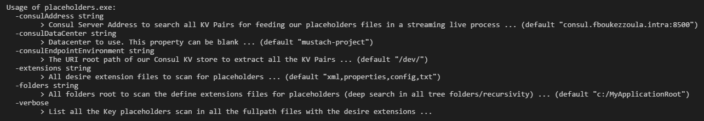

# PlaceholdersKit

Placeholder text until I can flesh this out more. I'll throw the source up on here for a later release (when I'm more happy with it, because it's my first Golang program); only created the Repo this early to host an Alpha release. Thank you for your patience and for your feedbacks ...

This program is useful for a Docker multi-environment deployment scenarios (INT, DEV, UAT, PRE-PROD, PROD environments, etc ...). Of course, it can be use for another type of multi-environment deployment scenarios : Cloud On-Promise, CSP, etc ..

# Goals and why this tool is useful :

* We have exactly the same docker image (same tag) : with the same binaries, application files and configurations files. All these files are already on the target(s) folder(s).

* Placeholders are configurable entries in your application that will be set to an actual value at deployment time. This allows the deployment docker image to be **environment-independent and thus reusable**.

* At deployment time, the placeholders will be resolved from dictionaries (taken from a Consul KV store) that are assigned to the target environment. During the deployment, "run" (docker stack deploy, docker-compose up, docker run ... ), we will replace all the placeholders, all the key names which are delimeter by {{...}} per default with their own values (KV Pairs), in all your configuration files with the correct value _**depend on the target deployment environment**_. 

* These environment values are taken from a Consul KV store during the deployment ("on the fly/live streaming"). The primary use case for this PlaceholdersKit tool is to be able to build native Consul-based configuration into your Docker image without needing glue such as environement variables, use tempories files, multiple sed commands, copy/move files, etc ...

# What are the command line arguments for this PlaceholdersKit tool ?

The command line arguments are :

_**-h**_ : 
Help of the PlaceholdersKit tool which explain all the command line arguments.  

_**-verbose**_ : 
List all the Key placeholders scan in all the fullpath files with the desire extensions.  
_(default "false")_

_**-extensions**_ : 
All desire extension files to scan for placeholders.  
_(default "xml,properties,config,txt")_

_**-folders**_ : 
All folders root to scan the define extensions files for placeholders (deep search in all tree folders/recursivity per default).  
_(default "c:/MyApplicationRoot")_

_**-consulAddress**_ : 
Consul Server Address to search all KV Pairs for feeding our placeholders files in a streaming live process.  
_(default "consul.fboukezzoula.intra:8500")_

_**-consulDataCenter**_ : 
Datacenter in your Consul to use. This property can be blank.  
_(default "mustach-project")_

_**-consulEndpointEnvironment**_ : 
The URI root path of our Consul KV store to extract all the KV Pairs.  
_(default "/dev/")_

  
  
 

