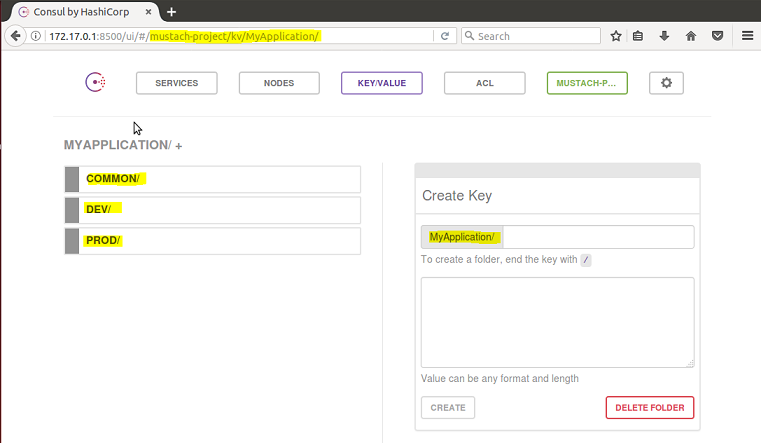
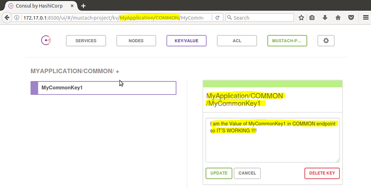
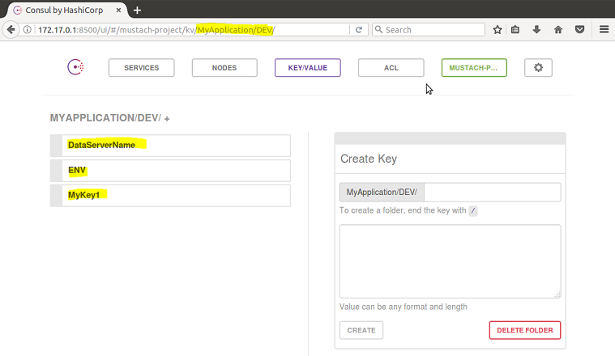
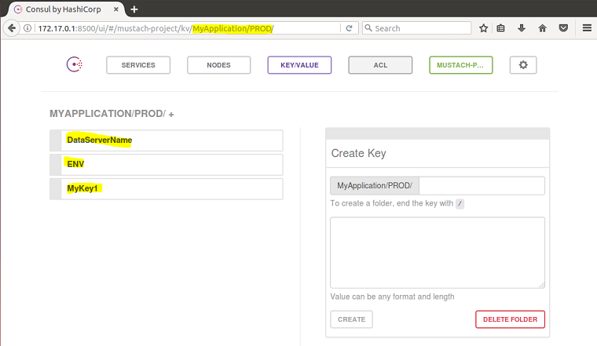
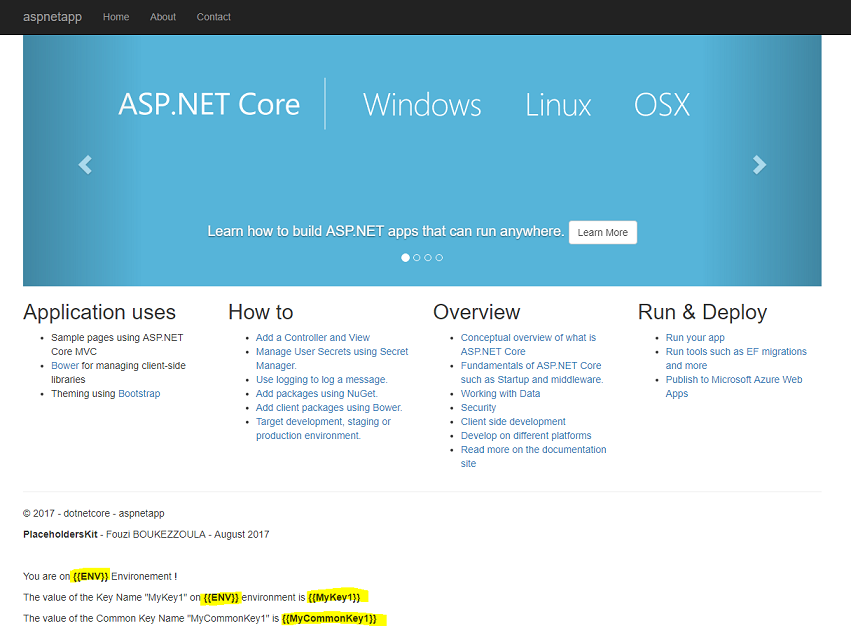
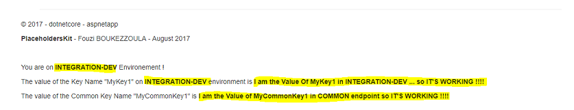
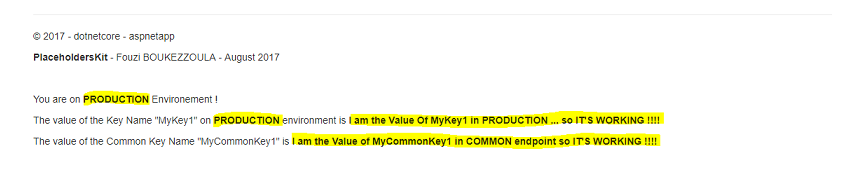

# A Full example illustrating the use of PlaceholdersKit tool ! 

# Goals :

We will use the Microsoft's template MVC dotnet application for this full example of using the PlaceholdersKit tool. It's a frontend application. We will update the homepage of the web site for adding several sentences **with placeholders**. The delimiters of these placeholders will be **{{...}}**. Notice that we will deploy the dotnet application in a Linux environment.

We will use the **new feature multi-stage building of Docker** by first building the dotnet solution (dotnet restore and dotnet publish goals) before creating our target docker image with only the fruits of this building (dotnet run goal). This docker application image will be always the same for all our deployments, **we will be in an environment-independent and thus reusable**. 

Then we will deploy the dotnet application (as a stack application Docker) in **INTEGRATION-DEV** environment by using all the Key Names taken in **an external KV Consul Store**, from the INTEGRATION-DEV endpoint. Then, after changing the environement as **PRODUCTION** by pointing to PRODUCTION endpoint, we will upadte the Docker service/stack application by re-deploying the same stack. 

# What do you need for executing this full example ?

You need to use a [KV Consul Store from Hashicorp](https://www.hashicorp.com/blog/consul-announcement/) and create this tree from the root path /kv  (tab **KEY/VALUE**) :

```
MyApplication/
    COMMON/
    DEV/
    PROD/
```
You should have something like this :



Below, **all the keys names and keys values** you should create on each node (COMMON, DEV and PROD) :

* **COMMON** :



| KeyName | KeyValue |
| --- | --- |
| `MyCommonKey1` | I am the Value of MyCommonKey1 in COMMON endpoint so IT'S WORKING !!! |

* **DEV** :


  
  | KeyName | KeyValue |
| --- | --- |
| `DataServerName` | DBSERVERDEV01 |
| `ENV` | INTEGRATION-DEV |
| `MyKey1` | I am the Value Of MyKey1 in INTEGRATION-DEV ... so IT'S WORKING !!!! |

* **PROD** :



| KeyName | KeyValue |
| --- | --- |
| `DataServerName` | DBSERVERPROD01 |
| `ENV` | PRODUCTION |
| `MyKey1` | I am the Value Of MyKey1 in PRODUCTION ... so IT'S WORKING !!!! |

# Multi-stage build Docker :

Execute these below commands for building our aspnet docker image :

```
git clone https://github.com/fboukezzoula/PlaceholdersKit.git
cd docker-full-examples
docker build -t aspnetapp .
```

We are using this Dockerfile (notice the multi-stage build) :

```
FROM microsoft/aspnetcore-build:1.1 AS build-env
WORKDIR /app

# copy csproj and restore as distinct layers
COPY *.csproj ./
RUN dotnet restore

# copy everything else and build
COPY . ./
RUN dotnet publish -c Release -o out

COPY /placeholders/placeholders.sh out

# build runtime image
FROM microsoft/aspnetcore:1.1
WORKDIR /app

COPY /placeholders/placeholders /usr/local/bin/placeholders

COPY --from=build-env /app/out .

RUN chmod +x /usr/local/bin/placeholders && chmod +x /app/placeholders.sh

ENTRYPOINT ["/app/placeholders.sh"]
```
Now we will use this same **docker image (aspnetapp) for all the environment deployments**. 

The application dotnet is locate on **/app** folder (look at the Dockerfile !). We have place severals placeholders in this application. In the homepage, in the file _**/Views/Shared/_Layout.cshtml**_, we have define these placeholders : {{ENV}}, {{MyKey1}} and {{MyCommonKey1}} like this (lines 40 to 50) 

```
<div class="container body-content">
    @RenderBody()
    <hr />
    <footer>
        <p>&copy; 2017 - dotnetcore - aspnetapp</p>
        <p><b>PlaceholdersKit</b> - Fouzi BOUKEZZOULA - August 2017</p><p>&nbsp;</p>
        <p>You are on <b>{{ENV}}</b> Environement !</p>
        <p>The value of the Key Name "MyKey1" on <b>{{ENV}}</b> environment is <b>{{MyKey1}}</b></p>
        <p>The value of the Common Key Name "MyCommonKey1" is <b>{{MyCommonKey1}}</b></p>		
    </footer>
</div>
```    
We have another placeholders in the root folder _**folders-for-placeholders-demonstration**_. For example, the file in _folders-for-placeholders-demonstration/folder1/web.config_ have these placeholders : **{{DataServerName}} {{ENV}}**

# Docker stack deploy and check all our placeholders :

* Only for checking, we won't point to a correct endpoint on our KV Consul Store server so we won't replace the placeholders with their correct values. To do that, only comment or change the line 17 of the **docker-compose.yml** line like this :

``` 
- PLACEHOLDERSKIT_CONSUL-ENDPOINT-ENVIRONMENT=/OM
``` 
Now you can deploy your stack application by executing this command :

* **docker stack deploy --compose-file docker-compose.yml placeholders**

You should have something like this when you browse the MVC dotnet application :



As you can notice in the bottom of the homepage, we can see all **our placeholders define in this file /Views/Shared/_Layout.cshtml**. 
If you enter inside your container (docker exec -it CONTAINERID bash), you will see that the file _folders-for-placeholders-demonstration/folder1/web.config_ have always these placeholders : **{{DataServerName}} {{ENV}}** without their correct Key Values, as the homepage because we are targetting a false endpoint on Consul.

# First Deployment : INTEGRATION-DEV environment

We are ready to use the PlaceholdersKit tool ! Be sure to update the docker-compose.yml file according your Consul KV Store server @IP Address. In our case, the placeholders are define in 2 types of extension files : cshtml (homepage) and config (files in the root folder   _folders-for-placeholders-demonstration_ not need for the dotnet application but only for using the PlaceholdersKit tool).  

  


# Second Deployment : Update to PRODUCTION environment

  


