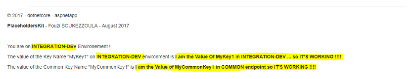

# A Full example illustrating the use of PlaceholdersKit tool ! 

# Goals :

We will use the Microsoft's template MVC dotnet application for this full example of using the PlaceholdersKit tool. It's a frontend application. We will update the homepage of the web site for adding several sentences **with placeholders**. The delimiters of these placeholders will be **{{...}}**. Notice that we will deploy the dotnet application in a Linux environment.

We will use the **new feature multi-stage building of Docker** by first building the dotnet solution (dotnet restore and dotnet publish goals) before creating our target docker image with only the fruits of this building (dotnet run goal). This docker application image will be always the same for all our deployments, **we will be in an environment-independent and thus reusable**. 

Then we will deploy the dotnet application (as a stack application Docker) in **INTEGRATION-DEV** environment by using all the Key Names taken in an external KV Consul Store, from the INTEGRATION-DEV endpoint. Then, after changing the environement as **PRODUCTION** by pointing to PRODUCTION endpoint, we will upadte the Docker service/stack application by re-deploying the same stack. 

# What do you need for executing this full example ?

You need to use a [KV Consul Store from Hashicorp](https://www.hashicorp.com/blog/consul-announcement/) and create this tree from the root path /kv  (tab **KEY/VALUE**) :

```
MyApplication/
    COMMON/
    DEV/
    PROD/
```
You should have something like this :


Below, **all the keys names and keys values** you should create on each node (COMMON, DEV and PROD) :

* **COMMON** :


| KeyName | KeyValue |
| --- | --- |
| `MyCommonKey1` | I am the Value of MyCommonKey1 in COMMON endpoint so IT'S WORKING !!! |

* **DEV** :


  
  | KeyName | KeyValue |
| --- | --- |
| `DataServerName` | DBSERVERDEV01 |
| `ENV` | INTEGRATION-DEV |
| `MyKey1` | I am the Value Of MyKey1 in INTEGRATION-DEV ... so IT'S WORKING !!!! |

* **PROD** :


| KeyName | KeyValue |
| --- | --- |
| `DataServerName` | DBSERVERPROD01 |
| `ENV` | PRODUCTION |
| `MyKey1` | I am the Value Of MyKey1 in PRODUCTION ... so IT'S WORKING !!!! |

```
FROM microsoft/aspnetcore-build:1.1 AS build-env
WORKDIR /app

# copy csproj and restore as distinct layers
COPY *.csproj ./
RUN dotnet restore

# copy everything else and build
COPY . ./
RUN dotnet publish -c Release -o out

COPY /placeholders/placeholders.sh out

# build runtime image
FROM microsoft/aspnetcore:1.1
WORKDIR /app

COPY /placeholders/placeholders /usr/local/bin/placeholders

COPY --from=build-env /app/out .

RUN chmod +x /usr/local/bin/placeholders && chmod +x /app/placeholders.sh

ENTRYPOINT ["/app/placeholders.sh"]
```


```
version: "3.1"

# docker stack deploy --compose-file docker-compose.yml placeholders

services:
  dotnet:
    image: aspnetapp

    ports:
      - 5000:5000

    environment:      
      - PLACEHOLDERSKIT_EXTENSIONS=config,cshtml
      - PLACEHOLDERSKIT_FOLDERS=/app
      - PLACEHOLDERSKIT_CONSUL-ADDRESS=172.17.0.1:8500
      - PLACEHOLDERSKIT_CONSUL-DATACENTER=mustach-project
      - PLACEHOLDERSKIT_CONSUL-ENDPOINT-ENVIRONMENT=/MyApplication/COMMON,/MyApplication/DEV

    command: 
      - placeholders
      
    networks:
      - placeholders-overlay
      
    deploy:
      mode: replicated
      replicas: 1
       
      restart_policy:
        condition: on-failure
        delay: 5s
        max_attempts: 5
        window: 120s
      
      update_config:
        parallelism: 1
        delay: 10s
        failure_action: continue
        monitor: 60s
        max_failure_ratio: 0.3

networks:
  placeholders-overlay:
    driver: overlay
```


* First DEPLOYMENT : we don't point to a correct endpoint on KV Consul store so we won't replace the placeholders. You should have something like this when you browse the MVC dotnet application :


As you can notice in the bottom of the homepage, we can see all **our placeholders define in this file /Views/Shared/_Layout.cshtml**. The placeholders are : {{ENV}}, {{MyKey1}} and {{MyCommonKey1}}


  


  


